# Automated DB Backups


**Instruction**: Set up a scheduled workflow to backup a Database every 30 minutes

**Project Goals**: The goal of this project is to set up a scheduled workflow to backup a Database every 30 minutes and upload the backup to **Cloudflare R2** which has a free tier for storage.

---

## Requirements

The pre-requisite for this project is to have a server set up and a database ready to backup.

- Set up a server on Digital Ocean or any other provider
- Run a MongoDB instance on the server
- Seed some data to the database

Once you have a server and a database ready, you can proceed to the next step.

**Scheduled Backups**

You can do this bit either by setting up a cron job on the server or alternatively set up a scheduled workflow in Github Actions that runs every 30 minutes and execute the backup from there. Database should be backedup up into a tarball and uploaded to Cloudflare R2.

Hint: You can use the `mongodump` to dump the database and then use `aws cli` to upload the file to R2.

**Stretch Goal**

Write a script to download the latest backup from R2 and restore the database.

> Database backups are essential to ensure that you can restore your data in case of a disaster. This project will give you hands on experience on how to set up a scheduled workflow to backup a database and how to restore it from a backup.

---

## Project Deliverables

1. **Project Setup**

   - Clone the repo to your local machine

   ```bash
   git clone https://github.com/PhilipOyelegbin/automated-db-backups

   cd automated-db-backups
   ```

2. **Server Orchestration And Configuration**

   - Generate a SSH key which will be needed to access the servers using the command `ssh-keygen -t rsa -b 4096 -f id_rsa -N ""`.
   - Run the commands below to provision the infrastructure.

   ```bash
   terraform init

   terraform apply
   ```

   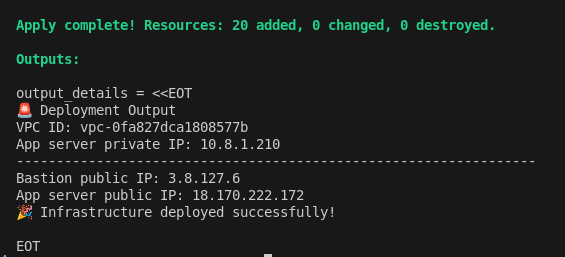

3. **Data Update**

   - SSH into the app server via the bastion host and update the variales in the scripts `dbbackup_and_upload.sh` and `restore_latest_backup.sh` to the right data.

   ```bash
   ssh -i id_rsa ec2-user@<BASTION_IP>
   ssh sysadmin@<APP_SERVER_IP>     # use the password from the configuration script
   sudo nano /usr/local/bin/dbbackup_and_upload.sh
   sudo nano /usr/local/bin/restore_latest_backup.sh
   ```

   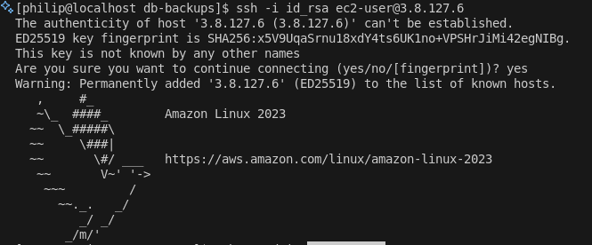
   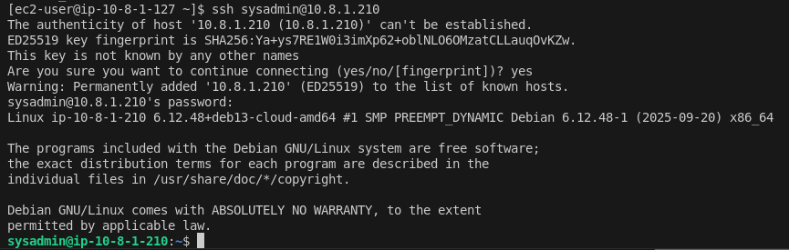
   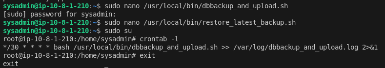

4. **Check Seeded Data**

   - Using a database client, check if seeded data exist on the daabase using the details user: `admin`, password: `ar@yA01.` and database: `araya_db` to login.

   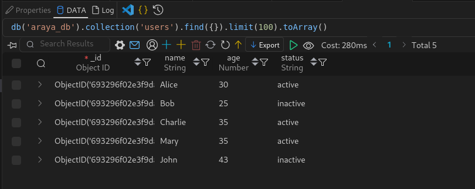

5. **Database Backup and Recovery**

   - Wait for 30 minutes for the first backup to take place. Check your R2 storage on cloudflare for the uploaded backup, you can also run the backup manually using the command `sudo bash /usr/local/bin/dbbackup_and_upload.sh`

   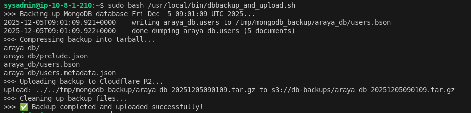
   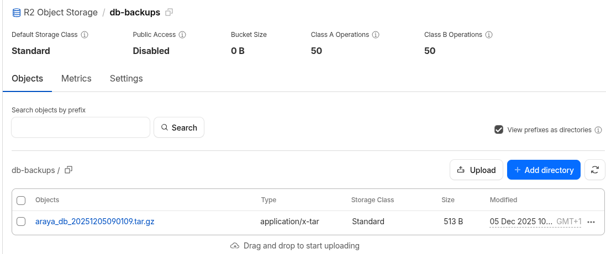

   - Add a new data to the database before the next 30 minutes and wait for the second uploaded backup.

   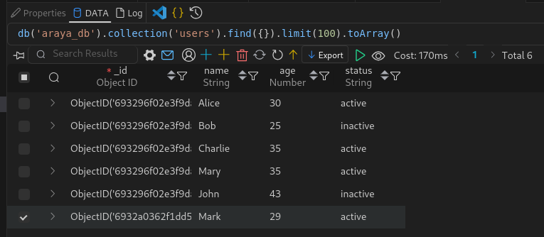

   - Delete some data from the database using the database client and run the restoration script using the command `sudo bash /usr/local/bin/restore_latest_backup.sh` to restore the latest backup

   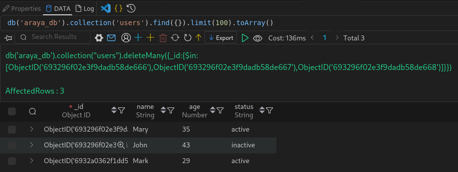
   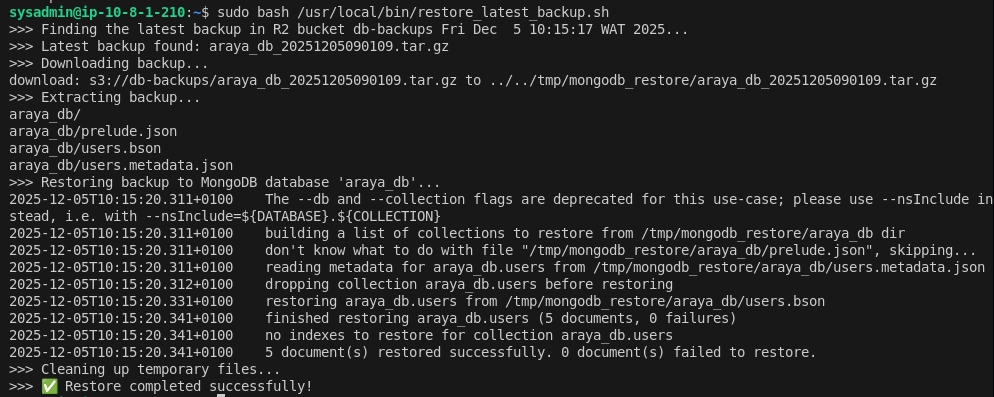

   - Refresh your database client to confirm the lost data has been restored.

   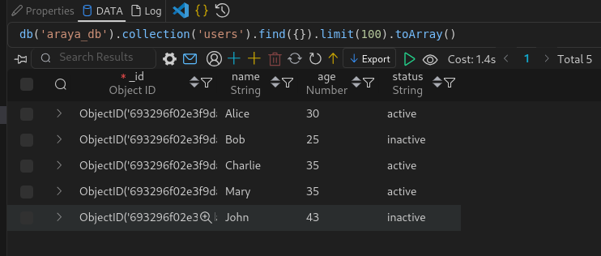

   > NB: The last data added was not restored beacause the last backup was taken before the data was added, the cron job failed to take the backup after the set 30 minutes interval due to some **SSL handshake error between the server and cloudflare which I a yet to figure out**. I also noticed cloudflare went down with an **internal server error**. This shows a typical situation of lost data and database restoration in a real life scenerio.

   ```
   upload failed: ../tmp/mongodb_backup/araya_db_20251205103001.tar.gz to s3://db-backups/araya_db_20251205103001.tar.gz An error occurred (SignatureDoesNotMatch) when calling the PutObject operation: The request signature we calculated does not match the signature you provided. Check your secret access key and signing method.
   ```

---

## Tools and Technologies

- **Operating Systems**: Amazon Linux 2023, Debian 13
- **Database**: MongoDB
- **Backup Tools**: tar
- **Security Tools**: SSH, Security Group
- **Version Control**: Git (for documenting and tracking configuration changes)

---

## Success Criteria

- All servers are configured, optimized, and secured.
- Demonstrated troubleshooting and resolution of at least three system issues.
- Successful recovery from a simulated disaster using database backup files.
- Clear and comprehensive documentation of the entire process.

---

## Conclusion

This project demonstrates the crucial steps for automating database backups and setting up a cron job for regular backups. By implementing this solution, you can ensure your data is safely backed up and easily recoverable in case of a disaster. The hands-on experience gained through configuring servers, automating tasks with cron job, and restoring data from Cloudflare R2 storage will provide valuable skills applicable to real-world production environments. While there were some challenges along the way, such as SSL errors and Cloudflare downtime, these are common scenarios that highlight the importance of proper backup strategies and disaster recovery planning. The stretch goal of creating a restore script further enhances the overall backup and recovery process, making this project a comprehensive solution for database management and protection.
